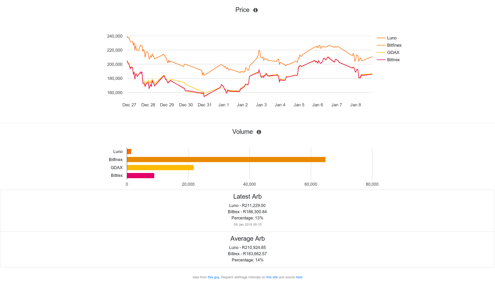

# Luno Arb

Simple site to display the general and historical arbitrage on the Luno exchange.



### Requirements 

Local:

```
- Python 3
- Git
- Selenium and Chrome web-driver
- Free account on [this](https://www.openexchangerates.org/) site or a different currency exchange API
```

### Quick Start

Local Django development environment:


Create your virtual environment:

```
python -m venv venv
```

Activate virtual environemnt:

```
source venv/bin/activate
```

Clone repo

```
git clone https://github.com/ebdekock/crypto.git
```

Install requirements

```
pip install -r requirements.txt
```


Set up Django DB

```
python manage.py migrate
```

Update secret key, currency api key and site site url in <b>settings.py</b>.<br>
Make any other adjustments.

Add cron

```
python manage.py crontab add
```

(Optional) Run initial cron manually:

```
python manage.py shell
>>> from spread.cron import currency_lookup
>>> from spread.cron import price_lookup
>>> currency_lookup()
>>> price_lookup()
>>> 
```

Start server

```
python manage.py startserver
```

## Running the tests

Functional Tests

Requires development server to be running. <br>
Runs test as an end user, uses Selenium to launch a headless browser and test for major sections of website and any console errors.

```
python manage.py test spread.functional_tests
```

Unit Tests

The index test creates mock entries in a test database and ensures the correct template is being used to render site. <br>
The cron test goes through all the exchanges and currency API calls to ensure all entries return correct types.

```
python manage.py test 
```

## Deployment

Quick-start development settings - unsuitable for production <br>
See https://docs.djangoproject.com/en/1.11/howto/deployment/checklist/

## Built With

* [Django](https://www.djangoproject.com/) - The web framework used
* [Requests](http://docs.python-requests.org/en/master/) - Make HTTP requests to access remote API's
* [Selenium](http://selenium-python.readthedocs.io/) - Functional tests

## Ack

* Idea from [here](https://www.tokenspread.com/).
